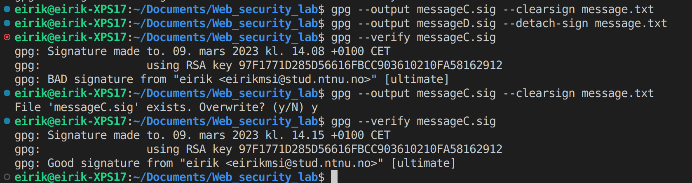

# Notes for project

I opend the *.sig file and by simpely adding an acsidental whitespace, I got an invalid signature.

Question 1: Generating a symmetric key k just for encrypting that one message seems like an unnecessarily complicated step. Why does GPG do that, instead of just encrypting the message with p?

The reason can be explained in two main points:

1. Using a symetric key is a lot faster than using private keys, espesiallity if one is going to send the message to several resipients.
2. It simplefies key managment by generating one common key for a single message so one does not need to store the public key of every resipient.
